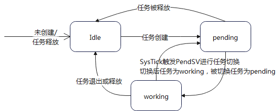

# play

# 简介

	首版本, 跑起来功能还算正常
	demo业务列表:
		任务0: 调用子函数进行循环计数,可以观察栈帧变化
				4个参数使用的寄存器和栈情况
		任务1: 使用任务参数进行累加,实际上就是自己加自己
		任务2: 纯计数
		任务3: 计数100次后结束任务,任务结束后会触发task_exit()
		系统任务: 这个任务在play_init()中创建,具有特权等级,纯计数,上述4个任务为非特权等级任务
	kernel功能列表:
		1. 创建普通任务(不具有特权等级)
		2. 创建系统任务(特权登记)
		3. 普通任务+系统任务当前配置最多创建10个,可自行修改
	计划列表:
		1. 内存管理,目前使用静态方式
		2. 链表
		3. 排他操作:锁,原子操作
		4. 任务间通信机制
		5. 增加系统服务
		6. 设备驱动
		7. 其他
# 编译/运行/调试
	目前只支持keil5,linux环境待后续版本功能完善后再补充
	1. 使用keil5打开projects/keil5/play_projects.uvmpw
	2. 默认使用模拟器调试,编译,然后直接开始debug即可
	3. main函数在source/dev/dev.c中

# 运行时信息

运行状态

任务状态转换

栈地址空间转换

# 平台信息
	暂时只支持cortex M3/M4
	mpu/fpu暂未启用
	调试设备型号:stm32f401ret6
	平台兼容计划:
	M4平台功能ok后会尝试向A系列兼容,增加mmu相关特性

