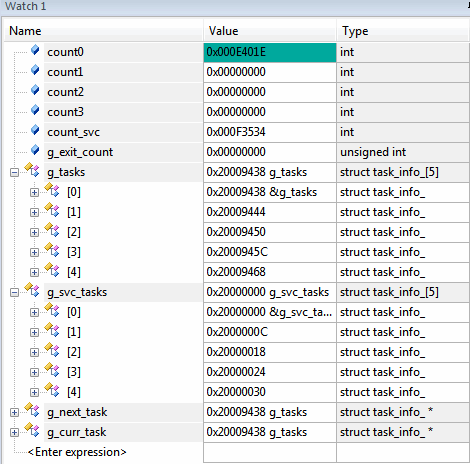

---

---

# play

玩是一种态度. 实践是检验真理的唯一标准.

play OS诞生了

虽然还不是很完善,但基本的东西都有了, 多任务, 内存管理, 特权资源保护, 系统任务和普通任务资源独立, ...

希望大家喜欢

# 简介

	首版本, 支持MPU,跑起来功能还算正常, 为了方便调试观察,默认任务调度周期是1000ms, 具体可以自行修改TASK_SWITCH_MS
	demo业务列表:
		任务0: 非特权任务, 调用子函数进行循环计数,可以观察栈帧变化
				4个参数使用的寄存器和栈情况
		任务1: 非特权任务, 使用任务参数进行累加,实际上就是自己加自己
		任务2: 非特权任务, 纯计数
		任务3: 非特权任务, 计数100次后结束任务,任务结束后会触发task_exit()移除自己
		系统任务: 特权任务, 纯计数
	kernel功能列表:
		1. 创建普通任务(不具有特权等级)
		2. 创建系统任务(特权等级)
		3. 普通任务和系统任务当前配置最多各创建5个,可自行修改
		4. 支持MPU设置, MPU默认配置参考下面内存MPU区域说明
		5. 支持动态分配内存:暂不支持按MPU不同区域独立分配
	计划列表:
		0. 完善任务调度策略
		1. 内存管理: 支持mpu特权区域和非特权区域内存独立分配
		2. 链表
		3. 排他操作:锁,原子操作
		4. 任务间通信机制
		5. 增加系统服务
		6. 设备驱动
		7. 其他
# 编译/运行/调试
	目前只支持keil5,linux环境待后续版本功能完善后再补充
	1. 使用keil5打开projects/keil5/play_projects.uvmpw
	2. 默认使用模拟器调试,编译,然后直接开始debug即可
	3. main函数在source/dev/dev.c中

# 运行时信息

运行状态

任务状态转换

栈地址空间转换

内存MPU区域说明

# 平台信息
	暂时只支持cortex M3/M4
	支持MPU
	fpu暂未启用
	调试设备型号:stm32f401ret6, keil5模拟器
	平台兼容计划:M4平台功能ok后会尝试向A系列兼容,增加mmu相关特性等

